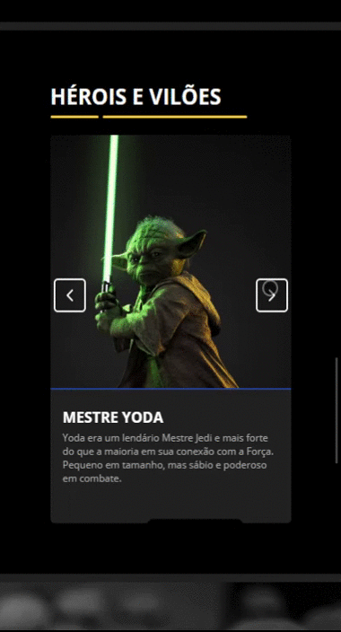

<h1>💻 Projeto Star Wars</h1>

Foi criado com o intuito de introduzir pessoas ao grande universo de Star Wars, onde abordo vários temas relacionados a saga de uma maneira simples e rápida, além de usar o projeto para por em pratica meus conhecimentos básicos de design e desenvolvimento web (HTML, CSS e JavaScript).

No site cada seção aborda um respectivo tema sobre a saga, eles são:

<ol>
<li>Breve história da saga</li>
<li>Filmes em ordem e suas sinopses</li>
<li>Apresentação dos personagens principais</li>
<li>Explicação do projeto</li>
</ol>

<h2>🎨 Layout</h2>
<h3>Web:</h3>

<h3>Mobile</h3>

  
  

<h2>🚀 Como acessar o site </h2>

Para poder acessar o site é necessário ter instalado qualquer navegador atualizado na sua versão mais recente, menos o IE (Internet Explorer), pois o site não tem suporte para esse navegador e provavelmente não irá rodar. Para visualizar e testar o site em sua máquina, basta clicar <a href='https://caio1902araujo.github.io/projeto-star-wars/'> aqui</a>.

<h2>🛠 Linguagens utilizadas </h2>
<ul>
<li>HTML</li>
<li>CSS</li>
<li>JavaScript</li>
</ul>

<h2>📝 Licença</h2>

Este projeto está sobe a licença MIT.

Feito por Caio Teixeira de Araujo.

